## Preface
So, you want to build your very own hardware (HW) accelerator, or more precisely, HW-accelerated system. Perhaps the desire stems from bottlenecks in software you routinely use, and the frequent coffee breaks are beginning to attract dubious looks from your coworkers. Another possibility is that today, your curiosity has exceeded a certain threshold, and satisfaction only comes in the form of a deep intuition for how software is executed by the underlying hardware in a given system. My last conjecture is that you finally got your hands on an FPGA-wielding embedded system and wish to learn more about which system-level optimization knobs are at your disposal. Regardless of the reason, you're here, and I hope this tutorial fulfills your needs as either a starting point for further extension of this work, a template for your own hardware accelerator project, or even as fundamental training. For me, I'm just happy knowing that 15 months of work has helped at least one other individual.

In this tutorial, my goal is to cover the development of a complete system: from designing a hardware accelerator at the <a href="https://en.wikipedia.org/wiki/Register-transfer_level">RTL level</a> (implemented and running in an <a href="https://en.wikipedia.org/wiki/Field-programmable_gate_array">FPGA</a>) to system integration (with an ARM CPU, system memory, etc.) to writing a device driver (which provides a kernel-level interface to the newly developed hardware) and ultimately, to modifications necessary in the <a href="https://en.wikipedia.org/wiki/User_space">user space</a> application. While the knowledge gained and experience acquired will be extremely rewarding, undertaking a project of this size requires commitment, perseverance, and the ability to debug without the assistance of <a href="https://stackoverflow.com/tour">Stack Overflow</a> or similar forums. I emphasize the last requirement (and it's a good skill to have in general) for two reasons:
1. *Development at this level is not heavily documented on public forums.* A Google search of a specific error message might yield zero results. Often your only source of information will come from sifting through technical reference manuals, <a href="https://www.altera.com/content/dam/altera-www/global/en_US/pdfs/literature/hb/arria-10/a10_5v4.pdf">like this one</a>. Perhaps Firework will help spark a new wave of interest in open source hardware accelerator and system design by making this work seem less daunting. The best resource to my knowledge for community support can be found at <a href="https://rocketboards.org/">RocketBoards.org</a>, although this may only be useful for <a href="https://rocketboards.org/foswiki/Documentation/Board">a certain set of development boards</a>.
2. *It shows you really understand how things work.* This is especially important when designing hardware and working with embedded systems where bugs could not only arise from user space applications, but also from incompatible system libraries, a device driver, limited system resources, misinterpreting the timing requirements of handshake signals in a bus protocol, errors in your RTL code, or (my personal favorite) from differences between expected and actual behavior of hardware modules.

Finally, I'd like to note that I don't claim to be an expert hardware accelerator/system designer *nor that my design is optimal*; the scope of this project alone is enough to lead to several outcomes (and getting the thing to work was a victory as far as I'm concerned). That's the beauty of open source; several minds are greater than one, and I hope that collaboration and the collective knowledge will lead to new and interesting ideas and perhaps better designs. I welcome any and all feedback and recommendations for improvement!

## Introduction
**Firework** is an *open source HW-accelerated system design* for offloading <a href="https://developers.google.com/protocol-buffers/">Protocol Buffer</a> serialization from the system's CPU. (That was a loaded sentence, I know. If I did my job correctly, by the end of this tutorial it'll make much more sense.) Generally speaking, Firework demonstrates the process of identifying components of software as candidates for hardware acceleration, designing hardware to efficiently perform (and replace) that computation, and building a system that deviates from the traditional paradigm of executing instructions sequentially on a CPU. Before I continue, it's necessary to give the term **system** a precise definition. In the context of hardware acceleration, I define a system as the combination of hardware and software that together perform a specific function. Therefore, the goal of this and any other hardware accelerator project is to improve a system's performance by co-optimizing the hardware and software that comprise that system. It's also worth nothing that the hardware community distinguishes between *hardware acceleration* and *offloading*, although the precise difference is a bit ambiguous. I classify Firework as an attempt to perform the latter since, in my design, I move the computation involved in Protocol Buffer serialization from the system's CPU to a custom processor implemented in an FPGA.

One of the goals of Firework was to target software that's deployed across a large-scale, production datacenter. That way, the developed HW-accelerated system could theoretically replace a generic server (or servers) supporting that application. (This work is part of a larger effort to explore forward-looking hardware in the datacenter.) Naturally, the first step was to identify such a candidate software applicaiton. Fortunately, I came across the paper <a href="https://static.googleusercontent.com/media/research.google.com/en//pubs/archive/44271.pdf">Profiling a warehouse-scale computer</a> whose authors essentially performed the search for me and provided motivation as well; in a three-year study of the workloads running across Google's datacenters, they were able to identify commonly used building blocks (i.e., low-level software) which they've coined the *datacenter tax*. This datacenter tax *"can comprise nearly 30% of cycles across jobs running in the fleet, which makes its constituents prime candidates for hardware specialization in future server systems-on-chips"*. Perfect! The following figure pulled from the paper shows these constituents and their individual contributions to the datacenter tax:


This led to my choice of Protocol Buffers ('protobuf' in the figure, accounting for ~3-4% of all CPU cycles consumed) as the candidate software for hardware acceleration. Protocol Buffers are Google's "language-neutral, platform-neutral extensible mechanism for serializing structured data". In other words, this software (which consists of a compiler and runtime library) is used to efficiently <a href="https://en.wikipedia.org/wiki/Serialization">serialize</a> structured data (e.g., a C++ object) into a stream of bytes that is subsequently stored or sent over the network via <a href="https://en.wikipedia.org/wiki/Remote_procedure_call">RPC</a> to a receiving service that's then able to reconstruct the original data structure from that stream of bytes. Before continuing to the [Prerequisites](README.md#prerequisites) section, I recommend reading <a href="https://static.googleusercontent.com/media/research.google.com/en//pubs/archive/44271.pdf">Profiling a warehouse-scale computer</a> for more context, going through the <a href="https://developers.google.com/protocol-buffers/docs/cpptutorial">Protocol Buffers C++ tutorial</a> to understand how Protocol Buffers are used, and learning how <a href="https://developers.google.com/protocol-buffers/docs/encoding">Protocol Buffers are encoded</a> as this is essential to the design of the hardware accelerator.

I chose the <a href="https://www.altera.com/products/boards_and_kits/dev-kits/altera/arria-10-soc-development-kit.html">Arria 10 SoC Development Kit</a> from Altera (<a href="https://newsroom.intel.com/news-releases/intel-completes-acquisition-of-altera/">now Intel</a>) as the platform for implementing Firework. In the section [Choosing a development board](README.md#1-choosing-a-development-board), I'll discuss why I chose this specific board.

Firework consists of six main components that, together, implement a HW-accelerated system and provide a means of measuring its performance. Each of these components listed below have a brief description and link to their repository.

#### Firework's six main components
- [protobuf-serializer](protobuf-serializer/): the RTL design of a *4-stage pipelined, parallel processor* that performs Protocol Buffer serialization, written in Verilog, and packaged as a Quartus Prime project. The nomenclature stems from four pipeline stages in the design, two parallel datapaths for processing incoming varint and raw data, and a controller that consists of seven independent <a href="https://en.wikipedia.org/wiki/Finite-state_machine">finite-state machines</a> (FSMs). Also provided are several <a href="http://www.asic-world.com/verilog/art_testbench_writing1.html">testbenches</a> to verify the logic of each FSM as well as the processor as a whole.
- [a10-soc-devkit-ghrd](a10-soc-devkit-ghrd): the Arria 10 SoC <a href="https://rocketboards.org/foswiki/Documentation/A10GSRD151GHRDOverview">Golden Hardware Reference Design (GHRD)</a> modified with the protobuf-serializer processor added as a memory-mapped FPGA peripheral. This too is packaged as a Quartus Prime project (the main SoC subsystem is a Qsys component, more on that later).
- <a href="https://github.com/altera-opensource/linux-socfpga">linux-socfpga</a>: the Linux kernel built for the Arria 10 SoC platform, developed and maintained by Altera. We'll configure and compile the kernel from source to enable certain CONFIG options (e.g., CONFIG_KALLSYMS which provides kernel-level symbols) needed to profile the system.
- [driver](driver): a platform device driver for the protobuf-serializer FPGA peripheral implemented as a loadable kernel module. This driver provides an interface for modifications necessary to the protobuf runtime library and is ultimately responsible for relaying data from user space memory to the HW peripheral residing in the FPGA.
- [protobuf](protobuf): a fork of Google's <a href="https://github.com/google/protobuf">Protocol Buffers</a> open source project. The runtime library is modified to send data to be serialized from user space memory to the protobuf-serializer FPGA peripheral for processing rather than the CPU.
- [profiling](profiling): this directory contains sample applications and a tutorial on using <a href="http://www.brendangregg.com/perf.html">perf-events</a> on the Arria 10 SoC Development Kit to profile both, *HW-accelerated* and *standard* (software/CPU) systems and hence giving you the ability to compare their performance. Here we "close the loop" (i.e., we finally see how a user space application, compiled once, is executed in the *standard* and *HW-accelerated* systems.

Although Firework covers the design of a hardware accelerator specifically for Protocol Buffer serialization using an Arria 10 SoC Development Kit, I was able to generalize the design process. The following sequence of high-level steps *are general enough to apply to any hardware accelerator project*, and the remainder of this tutorial provides in-depth coverage of each of these steps as they pertain to Firework.

#### High-level steps in building a HW-accelerated system
1. [Choosing a development board](README.md#1-choosing-a-development-board)
2. [Setting up your development environment (Installing an OS, VNC server/client, EDA tools, licensing)](README.md#2-setting-up-your-development-environment-installing-an-os-vnc-serverclient-eda-tools-licensing)
3. [Understanding the software you wish to accelerate](README.md#3-understanding-the-software-you-wish-to-accelerate)
4. [Implementing an FPGA peripheral (top-level I/O: ARM AMBA AXI4, Verilog, Quartus Prime, ModelSim)](README.md#4-implementing-an-fpga-peripheral-top-level-io-arm-amba-axi4-verilog-quartus-prime-modelsim) 
5. [System integration (Qsys)](README.md#5-system-integration-qsys)
6. [Creating an FPGA peripheral-aware bootable Linux image](README.md#6-creating-an-fpga-peripheral-aware-bootable-linux-image)
7. [Writing a device driver (interface between FPGA peripheral and user space application)](README.md#7-writing-a-device-driver-interface-between-fpga-peripheral-and-user-space-application)
8. [Closing the loop: modifying the user space application](README.md#8-closing-the-loop-modifying-the-user-space-application)
9. [Profiling the HW-accelerated system](README.md#9-profiling-the-hw-accelerated-system)

As a final note, this work can be quite challenging. It's essential to figure out a routine that works for you and knowing how to maintain a mental capacity for creativity over long periods of time, as this work is largely an art. For me, taking breaks when I feel the processor that is my brain overheating definitely helps. Another source of longevity are the inspiring words of world-renowned pop star <a href="https://www.youtube.com/watch?v=QGJuMBdaqIw">Katy Perry</a>.

## Prerequisites
Although not explicitly listed as a step, you should already have a project in mind, or at least an idea of which algorithm or software you wish to accelerate. For me, that's Protocol Buffer serialization as described in the introduction.

### 1. Choosing a development board
The first step is to choose a board that's appropriate for your project and goals. Since my objective was to build a HW-accelerated system for a *datacenter application* that both, improves performance and *frees the CPU resource*, I was in search of a board that's capable of running Linux and could theoretically replace a <a href="https://en.wikipedia.org/wiki/White_box_(computer_hardware)">white box</a> server in a datacenter setting. The <a href="https://www.altera.com/products/boards_and_kits/dev-kits/altera/arria-10-soc-development-kit.html">Arria 10 SoC Development Kit</a> seemed to fit this description perfectly; it combines an <a href="https://www.altera.com/products/fpga/arria-series/arria-10/features.html">Arria 10 FPGA</a> with a <a href="https://developer.arm.com/products/processors/cortex-a/cortex-a9">dual-core ARM Cortex-A9</a> processor (called the <a href="https://www.altera.com/products/soc/portfolio/arria-10-soc/arria10-soc-hps.html">Hard Processor System, or HPS)</a> in a single <a href="https://en.wikipedia.org/wiki/System_on_a_chip">system-on-chip (SoC)</a> package. The FPGA fabric could be used to implement a custom <a href="https://en.wikipedia.org/wiki/Register-transfer_level">RTL</a> design that performs Protocol Buffer serialization while the HPS could be used to support both Linux and the user space application. Plus, think about how cool you'd look with one of these bad boys sitting on your desk:


Although it is easiest to replicate and extend Firework using the Arria 10 SoC Development Kit, the main component - [protobuf-serializer](protobuf-serializer/) (i.e., the *hardware accelerator*) - is written in <a href="https://en.wikipedia.org/wiki/Verilog">Verilog</a> (with the exception of the <a href="https://en.wikipedia.org/wiki/FIFO_(computing_and_electronics)">FIFOs</a> used in the design - I pulled them from <a href="https://www.altera.com/en_US/pdfs/literature/ug/archives/ug-fifo-14.1.pdf">Altera's IP Cores library</a>) and is compatible with other ARM-based systems. The <a href="https://en.wikipedia.org/wiki/Modularity">modularity</a> of the hardware accelerator stems from the fact that it's designed as an <a href="https://www.arm.com/products/system-ip/amba-specifications">ARM AMBA AXI</a> *slave peripheral* (i.e., its top-level I/O ports implement an AXI <a href="https://en.wikipedia.org/wiki/Master/slave_(technology)">slave interface</a>) and ARM CPUs serve as AXI *masters*. More details of the hardware accelerator design and ARM AMBA AXI bus protocol are covered in the sections [Implementing the FPGA peripheral (top-level I/O: ARM AMBA AXI4, Verilog, Quartus Prime, ModelSim)](README.md#4-implementing-the-fpga-peripheral-top-level-io-arm-amba-axi4-verilog-quartus-prime-modelsim) and [System integration (Qsys)](README.md#5-system-integration-qsys).

At a minimum, you'll need a board with an FPGA (i.e., programmable logic) to implement a hardware accelerator. Other board requirements are specific to your project and goals. Questions you might ask to determine these requirements include:

- Is it a standalone algorithm or component of a larger software project I wish to accelerate? (i.e., do I need a CPU?)
- Is it a bare metal or Linux application (i.e., do I require the use of an operating system)?
- Am I replacing existing hardware? How does my design fit in to the larger system?
- Does it require network access?
- Am I working with large amounts of data? What are my storage requirements? 
- Which bottlenecks in the algorithm/software do I wish to alleviate?
- Would a custom hardware design outperform the existing CPU/memory architecture?

Don't underestimate the importance of this step. Acquiring a board can be an investment, and its fit with your project will certainly impact its success. Spending time asking and answering questions like these will also help to reaffirm your understanding of your project and goals.

### 2. Setting up your development environment (Installing an OS, VNC server/client, EDA tools, licensing)
Before we get to the fun, we need to put on our IT hats. The next step is to set up your hardware development environment. Your setup is primarily going to be determined by the board you choose, its corresponding set of <a href="https://en.wikipedia.org/wiki/Electronic_design_automation">EDA tools</a> necessary for implementing designs, and the computing resources available to you. The complexity of your project/design could even influence the setup, unfortunately, because it may mean requiring premium, licensed versions of the EDA tools for full functionality. (I think this old school business model is something the hardware industry needs to work on since the cost of the board and software licenses alone adds yet another barrier to hardware innovation. I'm happy to see Amazon taking steps in the right direction; they've begun rolling out <a href="https://aws.amazon.com/ec2/instance-types/f1/">F1 Instances</a> in their EC2 cloud, providing access to Xilinx FPGAs for hardware acceleration. I haven't tried using one myself, but I imagine it's much easier and cheaper than the method I describe below. Sorry for the rant.) For me, working with the Arria 10 SoC Development Kit meant installing <a href="http://dl.altera.com/16.1/?edition=standard&platform=linux&download_manager=direct">Altera's and supported third-party EDA tools</a> on a remote server I had access to via my company's <a href="https://en.wikipedia.org/wiki/Local_area_network">LAN</a>. As it turns out, setting up a hardware development environment on a remote server is not a trivial task. Fortunately for you, I've gone through the process and will cover the steps below. Although your setup may be different (board, tools, etc.), hopefully this section will give you an idea of what it takes to set up your environment.

I used the following server, operating system, and <a href="https://en.wikipedia.org/wiki/Virtual_Network_Computing">VNC</a> software for remote desktop access in my setup:
- <a href="http://www.dell.com/downloads/global/products/pedge/dell-poweredge-r720xd-spec-sheet.pdf">Dell PowerEdge R720xd</a> (server running the EDA tools)
- <a href="https://www.centos.org/download/">CentOS 7</a> (operating system running on the server)
- <a href="http://tigervnc.org/">TigerVNC</a> (VNC server software running on the server)
- <a href="https://www.realvnc.com/en/connect/download/viewer/">RealVNC VNC Viewer</a> (VNC client software running on my laptop)

My macbook served as the sole interface to both the remote server (via VNC client) where the EDA tools are installed and the Arria 10 SoC Development Kit (via terminal + minicom serial connection) which sat on my desk. Note that any laptop with the proper VNC client and serial communication software (minicom, PuTTY, etc.) installed should be fine. I'm still fascinated by the setup I ended up with: three computers, two geographic locations, and one keyboard/monitor to access them all simultaneously:


The reason why I used a server equipped with two <a href="https://ark.intel.com/products/64595/Intel-Xeon-Processor-E5-2670-20M-Cache-2_60-GHz-8_00-GTs-Intel-QPI">Intel Xeon E5-2670 CPUs</a> (each with 8, <a href="https://en.wikipedia.org/wiki/Simultaneous_multithreading">2-way SMT</a> cores), 256 GB of RAM, and 8 TB of storage is that <a href="https://www.altera.com/products/design-software/fpga-design/quartus-prime/overview.html">Quartus Prime</a> - the main EDA tool we'll be using for hardware development - has a "recommended system requirement" of 18-48 GB of RAM when working with Arria 10 devices. My laptop and I'm guessing most others are simply not powerful enough to support this software. I also know from experience that hardware compilation can take quite some time, so 32 parallel <a href="https://en.wikipedia.org/wiki/Thread_(computing)">threads</a> of execution will definitely come in handy, if fully utilized (hint: `-j 32` tells `make` to <a href="https://www.gnu.org/software/make/manual/html_node/Parallel.html">execute 32 recipes in parallel</a>).

Choosing CentOS 7 as the operating system to install on the server is less obvious. If you look at the <a href="http://dl.altera.com/requirements/16.1/">Operating System Support</a> for Quartus Prime and other EDA tools we'll be using, notice that only 64-bit variants of Windows and Red Hat Enterprise Linux (RHEL) are supported. Well, RHEL isn't free unlike most other Linux distributions (thanks to the '<a href="https://en.wikipedia.org/wiki/Enterprise_software"E</a>') so unless you already have access, CentOS is <a href="https://www.centos.org/about/">RHEL's altruistic cousin</a>. Although CentOS 7 is not explicitly supported, it works. Believe me. If you prefer to use Windows, that's fine too (well it's not, but that's beyond the scope of this tutorial).

It's quite a humbling experience to set up a server for the first time, and you'll certainly think twice before sending the next angry ticket to your IT support desk. Without further ado, here are the steps it took to set up my development environment.

#### Remotely installing CentOS 7 on a Dell PowerEdge R720xd server
To access the remote server, we'll initially use its built-in <a href="http://www.dell.com/learn/us/en/15/solutions/integrated-dell-remote-access-controller-idrac">integrated Dell Remote Access Controller (iDRAC)</a>. This tool has many powerful features, including the ability to monitor logged events, power cycle the server, and even install an OS - all remotely. Assuming the server is connected to your <a href="https://en.wikipedia.org/wiki/Local_area_network">LAN</a>, has been assigned an <a href="<a href="https://en.wikipedia.org/wiki/IP_address">IP address</a>, and the iDRAC is enabled, open any web browser and enter its IP address to access the iDRAC login screen. It should look something like this:


If this is your first time using the iDRAC, the <a href="http://en.community.dell.com/techcenter/b/techcenter/archive/2013/07/16/idrac7-now-supports-default-password-warning-feature">default username and password</a> are **root** and **calvin**, respectfully. When you log in, you'll see a summary page with several tabs (on the left side of the page and on the top of some pages) that provide a plethora of stats/info about your server. Now, we're ready to use the iDRAC to remotely install CentOS 7 on the server.

1. Download the <a href="https://www.centos.org/download/">CentOS 7 DVD ISO</a> image. Choose *DVD* instead of *Minimal* since we'll need to install a <a href="https://www.gnome.org/">GNOME Desktop</a> on the server.

2. Log in to the iDRAC and go to the *System Summary* page (default page upon login).

3. In the *System Summary* > *Virtual Console Preview* window, click **Launch**. This will download a Virtual Console Client called *viewer.jnlp*.

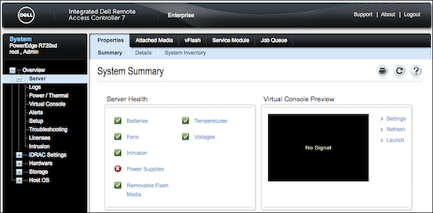

4. Run the *viewer.jnlp* Java application. Your computer may complain about it being from an unidentified developer, but there's a way around this. Right click *viewer.jnlp* > *Open With* > *Java Web Start (default)* and click **Open** in the window that appears.


5. This will open another window, *Security Warning*. Click **Continue**.


6. You can never be too cautious. This will open a new *Warning - Security* window that asks, *Do you want to run this application?* I think you know the answer. Click **Run**.


7. Great, we've finally opened the Virtual Console Client! Click anywhere in the window so that its menu appears in the <a href="https://support.apple.com/en-us/HT201956">OS X menu bar</a> at the top of your screen. Select *Virtual Media* > *Connect Virtual Media*. I couldn't take a screenshot of this step because when the Virtual Console Client is in focus, it captures all keyboard events. See the menu bar in the screenshot below.


8. Once connected, select *Virtual Media* > *Map CD/DVD ...* and select the CentOS 7 ISO image we just downloaded. Then click **Map Device**.

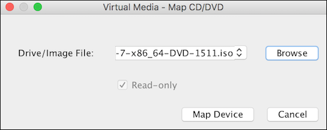

9. In the Virtual Console Client menu again, select *Next Boot* > *Virtual CD/DVD/ISO*. Click **OK** in the window that appears. This tells the server to boot from the CentOS 7 installer ISO we downloaded on the next boot.


10. In the Virtual Console Client menu, select *Power* > *Reset System (warm boot)*. You'll see "No Signal" appear on the window followed by the CentOS 7 installer screen when the server finishes rebooting. With *Install CentOS 7* highlighted, press **enter** to begin installation.


11. Follow the promts until you get to the *Software Selection* window. Select *GNOME Desktop* as your Base Environment. Select the *Legacy X Window System Compatibility*, *Compatibility Libraries*, and *Development Tools* add-ons in the list to the right. Click **Done** when your window looks like the one below.

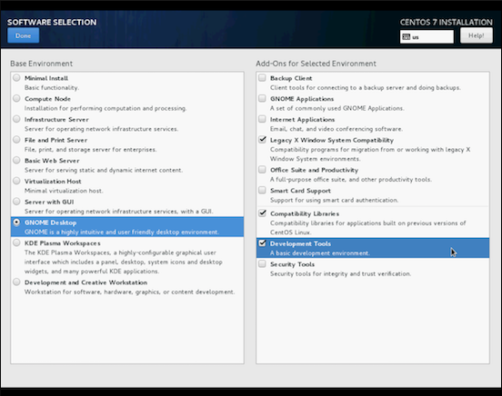

12. Select a disk to install to, select *Automatically configure partitioning.*, and (optionally) encrypt your data; I didn't. Click **Done** and proceed with the installation by selecting **Begin Installation** in the main menu. 

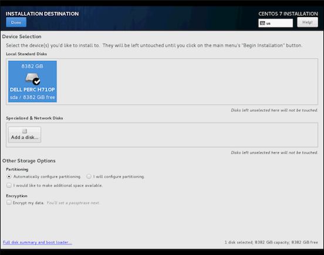

13. During the installation, it'll ask you to create a user account. Make the user an **administrator** and **set the root password**. DON'T FORGET TO SET THE ROOT PASSWORD. We'll need root access when installing the VNC server <a href="https://en.wikipedia.org/wiki/Daemon_(computing)">daemon</a>. Click **Reboot** when the installation completes and voila!

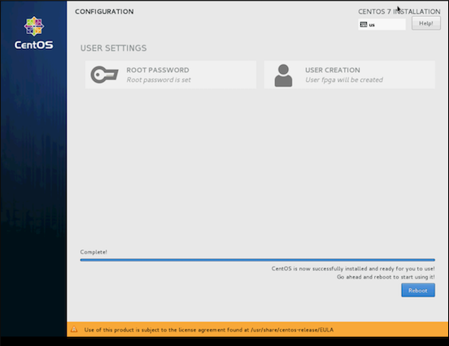

The server is now running CentOS 7. In the initial boot, it'll ask you to accept a license. Follow the prompts on the screen to accept the license, let it finish booting, and log in as the user you just created. Keep the Virtual Console Client open; we'll use it to set up the VNC server/client software in the next step.

#### Setting up VNC server and client software
If you're not familiar with <a href="https://en.wikipedia.org/wiki/Virtual_Network_Computing">VNC</a>, the basic idea is that you're interacting with a remote computer's desktop environment. That is, your keyboard and mouse events are sent to that computer over the network, and the corresponding GUI actions are relayed back to your screen. This is useful when you need to remotely access an application that has a GUI. As you may have guessed, this is the case of Quartus Prime and other EDA tools we'll be using.

I used <a href="http://tigervnc.org/">TigerVNC</a> as the *server* software running on the Dell PowerEdge R720xd and <a href="https://www.realvnc.com/en/connect/download/viewer/">RealVNC VNC Viewer</a> as the *client* softawre running on my macbook. I followed <a href="https://www.digitalocean.com/community/tutorials/how-to-install-and-configure-vnc-remote-access-for-the-gnome-desktop-on-centos-7">this tutorial</a> by Sadequl Hussain to get the VNC setup working for me, and I've summarized the steps below. I recommend going through his tutorial as it does a great job explaining each step in detail!

##### VNC server

1. Using the Virtual Console Client from the previous section, make sure you're logged in as the user you created and open a terminal. First, let's install the TigerVNC server software.

```
sudo yum install tigervnc-server
```

2. The previous step creates a template <a href="https://www.freedesktop.org/software/systemd/man/systemd.service.html">service unit configuration file</a> for the `vncserver` service in `/lib/systemd/system/`. We need to copy this file to `/etc/systemd/system` and make a few modifications in order to have <a href="https://www.freedesktop.org/wiki/Software/systemd/">systemd</a> automatically start this service for the logged in user when the server is reset or turned on.

```
sudo cp /lib/systemd/system/vncserver@.service /etc/systemd/system/vncserver@:5.service
```

3. Using the text editor of your choice (e.g., `vim`), open the file and replace every `<USER>` instance with the name of the user you created. I created a user with the name `fpga` and highlight where those changes are made in the screenshot below. Also add the option `-geometry 2560x1440` to the `ExecStart=` line replacing `2560x1440` with the resolution of the screen you plan to run the VNC Viewer client on. This will make full screen mode look pretty on your laptop or monitor.

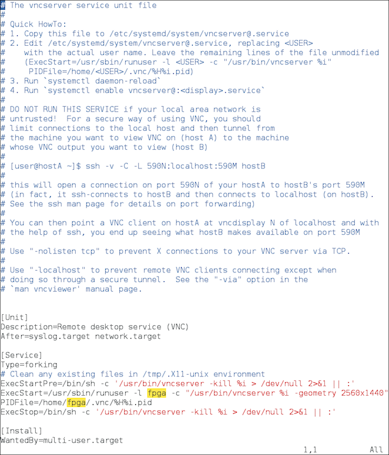

4. Use <a href="https://www.freedesktop.org/software/systemd/man/systemctl.html">systemctl</a> to reload the systemd manager configuration.

```
sudo systemctl daemon-reload
```

5. Enable the `vncserver` unit instance. Note the number `5` in `vncserver@:5.service` was chosen arbitrarily but means the `vncserver` running for this user will be listening for incoming connections on port `5905`.

```
sudo systemctl enable vncserver@:5.service
```

6. Configure the <a href="https://www.linode.com/docs/security/firewalls/introduction-to-firewalld-on-centos">firewall used by CentOS 7</a> to allow traffic through port `5905`.

```
sudo firewall-cmd --permanent --zone=public --add-port=5905/tcp
sudo firewall-cmd --reload
```

7. In the terminal, run `vncserver` and it'll ask you to set a password for opening VNC connections with this user. Note, this should be from the user's CentOS 7 login password.

8. With all the configurations made, let's make sure `vncserver` is running for this user before setting up the VNC Viewer client software.

```
sudo systemctl daemon-reload
sudo systemctl restart vncserver@:5.service
sudo systemctl status 
```

You should see `active (running)` in the output of the last command:


##### VNC client

1. Now that we have our VNC server running, let's set up the VNC client software on the device we'll use to remotely access the server (macbook for me). On your laptop, download the <a href="https://www.realvnc.com/en/connect/download/viewer/">RealVNC VNC Viewer</a> client, install, and open it. In the *VNC Server* field, enter `127.0.0.1:5900` but don't click **Connect** just yet. 


If you're familiar with computer networking, you may be wondering why we entered the IP address of the <a href="https://en.wikipedia.org/wiki/Localhost">localhost</a> and port `5900` instead of the IP address of our remote server and port `5905` (the port we set the VNC server to listen to for incoming connections). That's because after the initial authentication, all data communicated between the VNC server and client is unencrypted and hence susceptible to interception. To secure this communication channel, we'll set up an <a href="https://en.wikipedia.org/wiki/Tunneling_protocol">SSH tunnel</a> encrypting the data communicated over the network.

2. Open a terminal and enter the following command, replacing `<ip-address>` with the IP address of your server and `<user>` with the name of user you created when installing CentOS 7. 

```
ssh -L 5900:<ip-address>:5905 <user>@<ip-address> -N
```

It'll ask for the user's CentOS 7 password. Enter the password and it should leave the terminal in a hanging state - this means we've established our SSH tunnel and are ready to connect to the VNC server.


3. Click **Connect** in the VNC Viewer client and you should see the following warning, which we can now safely ignore. 

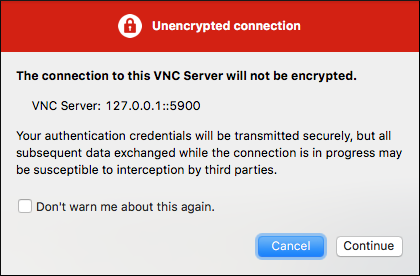

4. Click **Continue**. Enter the passowrd you set up for the VNC server and click **OK**.

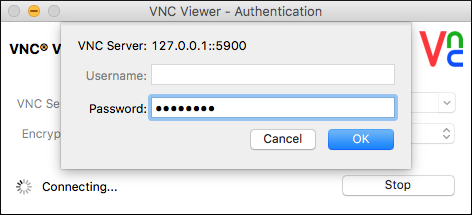

5. Congratulations! We just established our first remote desktop session with the CentOS 7 server! If you hover your curser above the top-middle of the window, a menu will appear. Click on the icon in the middle to enter *Full screen mode*. If you set the `-geometry` option with your screen's resolution, it should take up entire screen. Click on this icon again to exit *Full screen mode*.

 

Leave the VNC client session open; this is now our main way to interact with the remote server. We'll use it to first install and then use the EDA tools to design our FPGA peripheral hardware.

#### Installing Altera's EDA tools
To reiterate, some <a href="https://en.wikipedia.org/wiki/Electronic_design_automation">EDA tools</a> are free and some aren't. Some have free versions with limited features, and that may be all you need. Although I used licensed tools, I recommend using free versions where possible. You may even consider choosing a development board based on the free-ness of the toolchain necessary for compiling designs for that board (e.g., I later realized that a licensed Quartus Prime was required to even work with the Arria 10).

I used the following EDA tools in working with the Arria 10 SoC Development Kit: 
- <a href="https://www.altera.com/products/design-software/fpga-design/quartus-prime/overview.html">Quartus Prime Standard Edition</a>
- <a href="https://www.altera.com/products/design-software/fpga-design/quartus-prime/features/qts-qsys.html">Qsys System Integration Tool</a>
- <a href="https://www.altera.com/products/design-software/model---simulation/modelsim-altera-software.html">ModelSim-Intel FPGA Edition</a> (formerly ModelSim Altera Edition)

Note that although newer versions of the tools have been released, I used `version 16.1` and will continue using these tools throughout the tutorial. Feel free to download the latest release; the general design process is the same, but the interface may look slightly different.

The following steps should be completed on the CentOS 7 server through your open VNC client session.

1. From Intel's <a href="http://dl.altera.com/16.1/?edition=standard&platform=linux&download_manager=direct">Download Center</a>, download `version 16.1` of the *Quartus Prime Standard Edition* software and *device support for the Arria 10* (parts 1, 2, and 3). Select **Linux** as the operating system and **Direct Download** as the download method (setting up the *Akamai DLM3 Download Manager* takes extra effort and is unnecessary for a one-time download). You have a few options for downloading the necessary files. I avoided the *Complete Download* since it's a pretty huge file (23.9GB) and contains unnecessary device support. Instead, download the following individual files from the *Multiple File Download* section: 
- Quartus Prime Standard Edition Software (Device support not included)
- Quartus Prime Device Package 1 (Arria 10 part 1 & 2)
- Quartus Prime Device Package 2 (Arria 10 part 3)

Hardware companies have a lot on their plate, and sometimes it's difficult for them to deliver content in a concise, intuitive manner. Several options for how to download the software is an example. Here's another: maximize the page to make the arrows appear that allow you to actually download these files (see red box in the screenshot below).

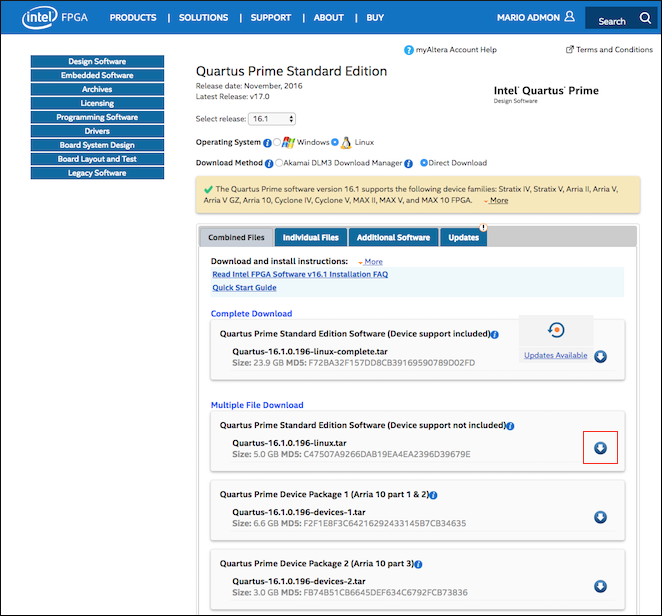

2. You should now have the following <a href="https://en.wikipedia.org/wiki/Tar_(computing)">tarballs</a> sitting in your `~/Downloads` (or other default) directory:
- Quartus-16.1.0.196-linux.tar
- Quartus-16.1.0.196-devices-1.tar
- Quartus-16.1.0.196-devices-2.tar

Before we begin extracting and installing the software, it's important to choose a directory as the root for all of your FPGA development; several files and directories will be generated as we build the design, and without organization, things can get unwieldy fast. Out of habit, I chose `~/workspace/` and use this in all the code blocks below (if you choose a different location, replace `~/workspace/` with your root in all paths that follow). In the root directory, let's also create directories for each of the components we downloaded (this will make your setup cleaner and easier to navigate in the future as more files/directories are generated or newer versions of the tools are downloaded).

```
mkdir ~/workspace
cd ~/workspace

mkdir a10-device-1,2 a10-device-3 quartus
mv ~/Downloads/Quartus-16.1.0.196-devices-1.tar a10-device-1,2
mv ~/Downloads/Quartus-16.1.0.196-devices-2.tar a10-device-3
mv ~/Downloads/Quartus-16.1.0.196-linux.tar quartus
```

3. Extract `Quartus-16.1.0.196-linux.tar` and run the `setup.sh` script.

```
cd quartus
tar -xf Quartus-16.1.0.196-linux.tar
./setup.sh
```

This will open an installer GUI. Click **Next**, accept the the agreement, and click **Next** again to reach the *Installation directory* window. By default, it chooses `~/intelFPGA/16.1`. Replace this with the root directory you chose followed by `intelFPGA/16.1`. Your window should look similar to the screenshot below.

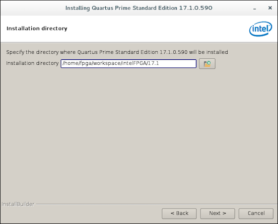

4. Click **Next** to reach the *Select Components* window. Select the following components (your selection may be different if you use free versions):


5. Continue clicking **Next** to proceed with the installation until it completes. You'll receive the following *Info* dialog which you can ignore because we'll install Arria 10 device support files next:


6. Extract `Quartus-16.1.0.196-devices-1.tar` and run the `dev1_setup.sh` script.

```
cd ~/workspace/a10-device-1,2
tar -xf Quartus-16.1.0.196-devices-1.tar
./dev1_setup.sh
```

Following the same steps to install Quartus Prime, let's now set up Arria 10 device support in Quartus Prime. When you reach the *Select Components* window, select all devices (it should only show Arria 10 Part 1 and 2): 

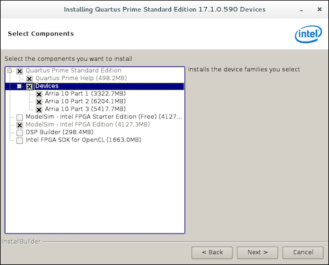

You'll receive another interesting pop-up dialog, this time called *Warning*, letting you know that Arria 10 device support requires three separate installation files. Don't worry Quartus, we'll do this next. Follow the prompts to finish the installation.


7. Repeat step 6. again, but this time extract and install part 3 of the Arria 10 device support.

To summarize, we now have Quartus Prime Standard Edition, Qsys System Integration Tool (bundled with Quartus Prime), and ModelSim-Intel FPGA Edition installed with support for Arria 10 devices on the remote CentOS 7 server. Yay!

8. Now let's add the Quartus Prime binary, `quartus`, to the `PATH` <a href="https://en.wikipedia.org/wiki/Environment_variable">environment variable</a> so you can simply type `quartus` in an open terminal to run the software. I'll leave it to you to decide whether you want to do this permanently (editing `~/.bashrc`) or temporarily (`export PATH=$PATH:<path-to-quartus>` in an open terminal). The path to `quartus` is: `~/workspace/intelFPGA/16.1/quartus/bin/`.

The first time you open Quartus Prime, a *License Setup Required* dialog will appear. In the next section, we'll set up the license manager and serve the license we acquired from Intel, giving us full access to Quartus Prime Standard Edition, ModelSim-Intel FPGA Edition, and Arria 10 device support.


#### Setting up the license manager, serving a license
Remember when I said setting up an environment for hardware development is a nontrivial task? Well, licensing is the crux of its nontrivial-ness. I don't even know where to begin - from the difficulty in identifying which EDA tools or components of these tools (e.g., the MegaCore IP Library in Quartus Prime) require licenses to whether I'll even be using certain tools in my project. And that's only the beginning - where and how to even acquire a license isn't obvious, there are different license types to choose from (*fixed* and *floating*), and when you finally receive a license, you still need to add some not-so-obvious information to the file before it can be properly served by a <a href="https://www.ics.com/files/docs/bx/5/bxref/ref_5f.htm">license manager</a> (that's right, yet another piece of software required to get Quartus Prime and other EDA tools working).

Once you have all the proper EDA tools installed and you've acquired the necessary license to unlock their features, serving the license is the final challenge. [queue <a href="https://youtu.be/9jK-NcRmVcw">The Final Countdown</a>] Thanks to an act of incredibly poor engineering, the *fixed license* I acquired is not only tied to the <a href="https://en.wikipedia.org/wiki/MAC_address">MAC address</a> of the <a href="https://en.wikipedia.org/wiki/Network_interface_controller">NIC</a> on my server (which I get, they want to limit its use to one, uniquely-identified computer), but it **ONLY recognizes NICs that are named `eth0` from Linux's perspective**. Well, <a href="https://en.wikipedia.org/wiki/Consistent_Network_Device_Naming">upon further research</a> I found out that CentOS 7's choice of `em1`, `em2`, etc. for naming its network interfaces is actually the modern approach that supersedes the `eth0`, `eth1`, etc. naming convention. To fix this issue, <a href="http://www.sysarchitects.com/em1_to_eth0">like this guy</a>, I had to rename `em1` to `eth0` to finally get Quartus Prime to recognize I'm using the computer this license was made for. Ultimately, what it took was patience, the ability to make sense of the information I had, some guess-and-check work, and reading through this 46-page manual: <a href="https://www.altera.com/content/dam/altera-www/global/en_US/pdfs/literature/manual/quartus_install.pdf">Intel FPGA Software Installation and Licensing</a> on licensing. I'll try to spare you the trouble by summarizing the steps below. (Note: it appears they've taken my advice and fixed the `eth0` problem. When my server crashed and I had to reinstall everything, I didn't have to rename `em1` to get the licensing to work!)

1. Acquire the license you need. I wouldn't bother with the <a href="https://www.altera.com/mal-all/mal-signin.html?targetResource=https%3A%2F%2Fsso.altera.com%2Fpf%2Fadapter2adapter.ping%3FSpSessionAuthnAdapterId%3DOTKSiebel%26TargetResource%3Dhttps%253A%252F%252Fmysupport.altera.com%253A443%252FAlteraLicensing%252Flicense%252Findex.html">Self-Service Licensing Center</a>. Instead <a href="https://www.altera.com/about/contact/contact.html">contact an Intel licensing representative</a> directly and ask for a license for *Quartus Prime Standard Edition* and (optionally) *ModelSim-Intel FPGA Edition*. Quartus Prime Standard Edition (or Pro) is <a href="https://www.altera.com/products/design-software/fpga-design/quartus-prime/download.html">required when working with Arria 10 devices</a> and is used to implement the FPGA hardware design. I used ModelSim-Intel FPGA Edition to <a href="http://quartushelp.altera.com/15.0/mergedProjects/reference/glossary/def_funsim.htm">verify the logic</a> of each subsystem of the RTL design as well as the hardware accelerator as a whole. I haven't tried it myself, but I suspect you may be able to perform the simulations I've included in the tutorial using the free version, ModelSim-Intel FPGA Starter Edition.

2. After the last step, you should've received an email with the license as an attachment. Create and move the license to a directory called `license` in your root directory. I used `scp` to copy the license from my macbook to the CentOS 7 server. Accessing your email from the server directly is another option.


3. We need to edit the license before it can be served. First, **copy** and rename the license to `/usr/local/flexlm/licenses/license.dat`. This is where we'll tell the FLEXlm license manager to look for a license file called `license.dat` to serve.

```
sudo mkdir -p /usr/local/flexlm/licenses
sudo cp ~/workspace/license/1-FQMLCP_License.dat /usr/local/flexlm/licenses/license.dat
```

4. Using the text editor of your choice, open `license.dat` and add the following lines near the top. See the screenshot below to see where I made the changes.

```
SERVER <hostname> <MAC address of NIC>
VENDOR alterad "<your-working-dir>/intelFPGA/16.1/quartus/linux64/alterad"
VENDOR mgcld "<your-working-dir>/intelFPGA/16.1/modelsim_ae/linuxaloem/mgcld"
USE_SERVER
```

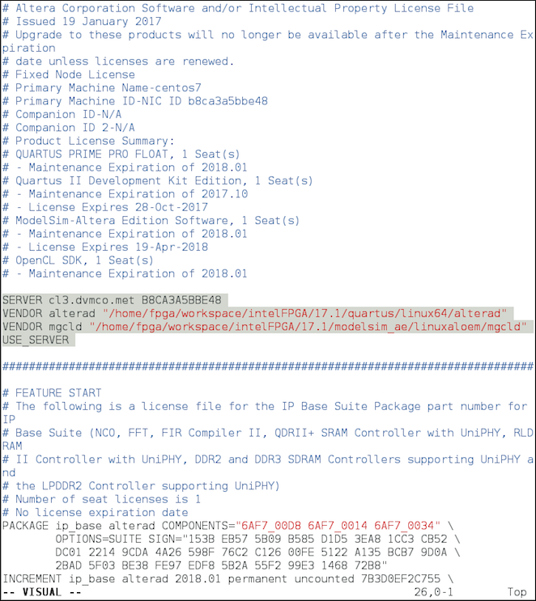

To obtain your server's `<hostname>`, run `uname -n` in a terminal.

You should already know the MAC address of your NIC since it was needed to acquire the license. Just in case, run `ifconfig` to list the network interfaces on your machine, identify which one you're actively using (I have `em1` connected to the network), and the MAC address will be the 12-digit, colon-separated hex value following `ether`:

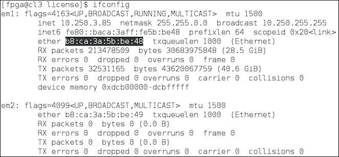

The next two `VENDOR` lines specify the locations of the Quartus Prime and ModelSim <a href="https://en.wikipedia.org/wiki/Daemon_(computing)">daemons</a> that FLEXlm runs to serve their features. These daemons were included with the Quartus Prime and ModelSim installation.

5. Now we're ready to serve our license! Run the following command to start the FLEXlm license manager and serve our license. The FLEXlm binary was also included in the Quartus Prime installation.

```
cd ~/workspace
intelFPGA/16.1/quartus/linux64/lmgrd -c /usr/local/flexlm/licenses/license.dat
```

... we were so close! I'm referring to the following error: `/lib64/ld-lsb-x86-64.so.3: bad ELF interpreter: No such file or directory` you probably received the first time running the license manager:


Giving credit to <a href="https://software.intel.com/en-us/articles/flexlm-license-manager-20-may-fail-when-lsb-3-is-not-met">this post</a>, there's nothing a simple <a href="https://en.wikipedia.org/wiki/Symbolic_link">symbolic link</a> can't fix! We have a functional <a href="https://linux.die.net/man/8/ld-linux">program loader</a> running on the CentOS 7 server, I promise; the <a href="https://stackoverflow.com/questions/1951742/how-to-symlink-a-file-in-linux">symlink</a> we'll create let's FLEXlm call it `ld-lsb-x86-64.so.3` if it likes.

```
sudo ln -s /lib64/ld-linux-x86-64.so.2 /lib64/ld-lsb-x86-64.so.3
```

6. Run the command to start FLEXlm again and voila! You'll see a log of information from FLEXlm `(lmgrd)`, the Altera daemon `(alterad)`, and the ModelSim daemon `(mgcld)`. (Completely unrelated, but I'm guessing `lmgrd` stands for "license manager daemon")


7. Uh-oh! Upon further inspection, we see that FLEXlm failed to launch the ModelSim daemon at time `15:56:59`:

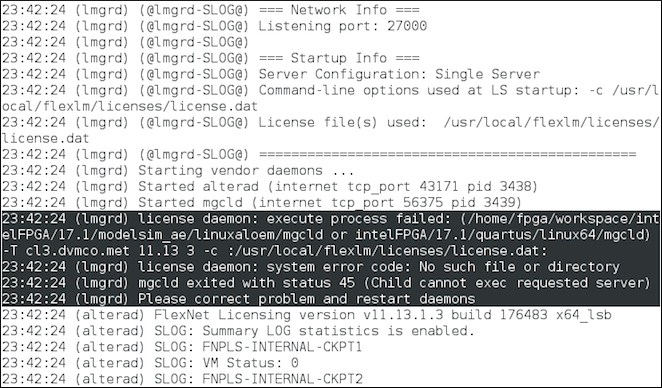

That's not good. What could be the problem? Well, I tried running the daemon directly and received the following error message: 


That looks familiar! This time it's the 32-bit version of the program loader that's missing, but why does `mgcld` want to use a 32-bit program loader on a 64-bit architecture? If we revisit the <a href="https://www.altera.com/support/support-resources/download/os-support.html">Operating System Support</a> page and look closely at the *ModelSim-Intel FPGA Edition* entry in the table, there's a supercript on the checkmark -  - that corresponds to the following note:


So obvious! Shame on us. Let's install the 32-bit program loader, `ld-linux.so.2`, which belongs to the `glibc` package.

```
sudo yum install ld-linux-so.2
```

Note, `i686` in the output refers to Intel's 32-bit <a href="https://en.wikipedia.org/wiki/X86">x86</a> architecture while `x86_64` refers to <a href="https://en.wikipedia.org/wiki/X86-64">64-bit</a> architecture. Let's run `mgcld` again to confirm we fixed the issue.


That looks promising!

8. Restart FLEXlm to successfully serve both Quartus Prime and ModelSim features this time. We'll use `ps` to identify the currently-running `lmgrd`'s <a href="https://en.wikipedia.org/wiki/Process_identifier">process ID (PID)</a> and kill it with the `kill -9` command.

```
ps aux | grep lmgrd
kill -9 <PID>
```

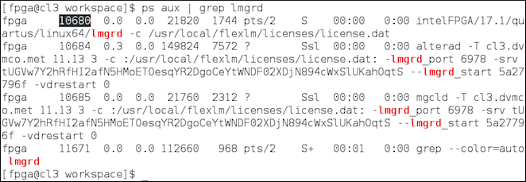

Now we can restart FLEXlm:

```
~/workspace/intelFPGA/16.1/quartus/linux64/lmgrd -c /usr/local/flexlm/licenses/license.dat
```

As long as you don't see any error messages in the log, all features of Quartus Prime and ModelSim should now be properly served. Here's what the tail end of my log looks like:


9. Open Quartus Prime. Again, you'll see the *License Setup Required* dialog appear but this time we're ready to specify the license we're using. Select *If you have a valid license file, specify the locaiton of your license file* option and click **OK**. 


10. Specify the locaiton of the license file and click **OK**.

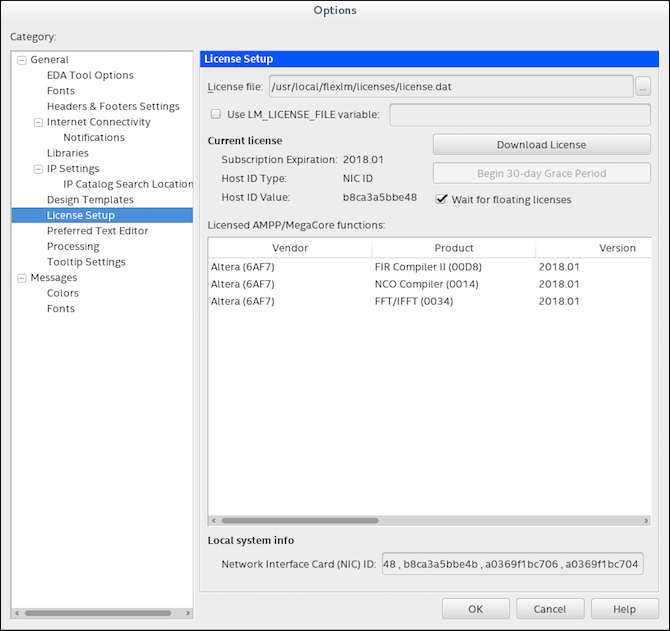

11. Voila! We now have Quartus Prime Standard Edition running with its features properly licensed and activated!


That was quite the process, I know. To summarize, we learned how to remotely interact with a Dell PowerEdge R720xd server using its built-in iDRAC controller, install CentOS 7 on the server with a GNOME Desktop environment, install VNC server and client software on the server and macbook respectively, install the Altera EDA tools (Quartus Prime Standard Edition, ModelSim-Intel FPGA Edition) we'll be using with the Arria 10 SoC Development Kit, and acquire and serve a license for the features we need. With our board selected and hardware development environment set up, we're now ready to begin designing the HW-accelerated system!

### 3. Understanding the software you wish to accelerate
*This is perhaps the most important step.* Time spent here will directly impact how you approach the problem, the design of your hardware accelerator, and ultimately your success in imporving overall system performance. A philosophy I adhere to is that one's understanding of how something works is directly proportional to that individual's ability to debug issues or improve upon its design. When you're attempting to replace components of a large software project with specialized hardware, this is especially true. The goal of this step is to fundamentally understand **the movement of and operations on data** and to identify *performance bottlenecks* in the software. Is the system *memory bandwidth-limited*? Is it *computation-limited*? Answering these questions will give you insight into what can be tuned to improve the system's performance.

If you're working with someone else's software, extra time is needed to understand how the code is structured and to identify relevant source files, data structures, functions, etc. that are involved in the computation you wish to replace. This was the case for me in working with <a href="https://developers.google.com/protocol-buffers/">Protocol Buffers</a>; I had no prior experience using them nor was I familiar with <a href="https://developers.google.com/protocol-buffers/docs/encoding">varint encoding</a> - the main mechanism used in Protocol Buffer serialization. As demonstrated later in this section, there are powerful tools available that can be very helpful in obtaining this knowledge. One such example is the combination of <a href="http://www.vim.org/">vim</a> + <a href="http://ctags.sourceforge.net/">ctags</a>; using this combo left me exuberant when it helped me understand how user space applications interact with the compiler-generated code which in turn interacts with the `libprotobuf.so.10.0.0` runtime library. My understanding was further cemented by using <a href="https://www.gnu.org/software/gdb/">gdb</a> to step through an application and inspect the <a href="https://en.wikipedia.org/wiki/Stack_trace">stack trace</a> as it performed the serialization. This helped me pinpoint the classes and methods that are responsible for encoding and serializing the various fields of Protocol Buffer Messages. These methods would serve as templates for the computational portions, or the <a href="https://en.wikipedia.org/wiki/Datapath">datapath</a>, of the hardware accelerator. These methods also shed light on how data would eventually be communicated between the ARM CPU and hardware accelerator (co-processor in this setup).

- First, I'll give an overview of the Protocol Buffer software, then I'll show how using these tools helped me understand how the code was structured and which source files and classes are relevant to serialization. 
- Overview of Protocol Buffers, Messages, field types, encoding
- Diagram showing user space application, compiler-generated code, runtime library

Tutorial:
- Go through the Protocol Buffer C++ tutorial: https://developers.google.com/protocol-buffers/docs/cpptutorial
- Understand how Protocol Buffers are encoded: https://developers.google.com/protocol-buffers/docs/encoding
- Encode an example Protocol Buffer Message by hand
- Build & install [google/protobuf] on the CentOS 7 server (git clone, specific tag, building)
- Run the example applications, compare binary output to handcoded message, and a-ha! It works as expected
- Understand the software stack of Protocol Buffer serialization
    a. Step through using: vim + ctags
    b. Step through using: gdb + stack traces
- Compiled Message classes: series of calls to WireFormatLite::Write*, CodedOutputStream::Write* (and describe SerializeWithCachedSizesToArray() as lowest high-level serialization method)
- WriteVarint32ToArray(): planned to accelerate this function only based on use (all varints, tags, etc.) and you know the rest (see below) :D

- **realized** fields could all be categorized into two separate datapaths (varint encoded, raw data)
Before diving into the hardware design, I'd like to share a great example of how the time I spent understanding this software led to a realization which led to a huge simplification in the hardware design as well as expanding what it supports. It went from a toy example to something much more robust and closer to seeing the light of day in a production datacenter ...an initial simplification I attempted to make (i.e., only supporting 32-bit varints) and how taking time to understand fundamentally that an even lower abstraction than twas provided by Protocol Buffer fields) how the data was encoded led to a simplification and (in my opinion), beautiful approach to the hardware design. I realized that despite there being 18 field types (omitting groups, since they're depreciated), they all boil down to either *varint-encoded* data or *raw data* that needed to be simply passed on, preserving the ordering/sequence of fields of course.

- If I could go back, I'd also do - perf/profiling: guage whether specialized hardware could outperform software; analyze cost of overhead of communicating data (lack of experience analyzing system performance, thought the paper provided sufficient motivation, overwhelmed with too many other things to figure out)

## Hardware Development
Now, let's see how we can translate WriteVarint32ToArray() into a hardware accelerator and integrate our FPGA peripheral with the HPS.

### 4. Implementing an FPGA peripheral (top-level I/O: ARM AMBA AXI4, Verilog, Quartus Prime, ModelSim)
- Intro
    - Writing your own RTL vs. OpenCL
    - FPGA development flow (Quartus Prime is the main tool in this step, ModelSim for funcitonal verification)
    - RTL design is an art
    - Choosing an HDL: Verilog-2005(?) vs. SystemVerilog
    - Already enough complexity: see which HW modules are available to you in the IP Catalog
    - What determine's top-level I/O? - ARM AMBA AXI4 specification
- Training 
    - Intel online training
      - https://www.altera.com/support/training/course/odsw1005.html
      - https://www.altera.com/support/training/course/odsw1006.html
      - https://www.altera.com/support/training/course/ohdl1120.html
      - https://www.altera.com/support/training/course/odsw1100.html
    - Verilog tutorials
      - http://www.asic-world.com/verilog/veritut.html
    - Digital Design by Frank Vahid
- RTL design
    - architecture, FSMs, etc.
- Tutorial
    - [protobuf-serializer]
    - Using Quartus Prime (import project, layout, files, etc.) 
    - Running ModelSim testbenches

### 5. System integration (Qsys)
- Intro
    - Qsys is the tool used here
    - Training that helps: Custom IP Development Using Avalon and AXI Interfaces
    - Interfaces (clock, reset, interrupts, Avalon, AXI, conduits)
    - Most powerful Qsys tool: auto-generated interconnect (you develop an AXI slave interface, simply connect to AXI master component)
- Training (Intel online training)
    - Intel online training
      - https://www.altera.com/support/training/course/oqsys1000.html
      - https://www.altera.com/support/training/course/oqsyscreate.html
      - https://www.altera.com/support/training/course/oqsys3000.html
    - Rocketboards.org
      - https://rocketboards.org/foswiki/Documentation/A10GSRDV160CompilingHardwareDesign
- Tutorial
    - [a10-soc-devkit-ghrd]
    - Adding protobuf-serializer to the GHRD!

## Software Development
The operating system, device driver, user space application

### 6. Creating an FPGA peripheral-aware bootable Linux image
- Intro
    - Discuss why running Linux is important (mimic's real datacenter setting)
    - Talk about Yocto Project, embedded Linux, etc.
    - Angstrom Linux distribution maintained for the Arria 10, other Altera boards
    - Working with Linux source code, configuring, compiling, and zImage for bootable microSD card
    - Overview of the boot process
    - Rocketboards.org training on creating the U-Boot bootloader, Linux device tree, rootfs, and formatting the microSD card
- Training
    - Rocketboards.org
      - https://rocketboards.org/foswiki/Documentation/A10GSRDV160GeneratingUBootAndUBootDeviceTree
      - https://rocketboards.org/foswiki/Documentation/A10GSRDV160GeneratingTheLinuxDeviceTree
      - https://rocketboards.org/foswiki/Documentation/A10GSRDV160CreatingAndUpdatingTheSDCard
- Tutorial
    - [linux-socfpga]
    - Configure and compile Linux kernel (cross-compile, see link below)
      - https://rocketboards.org/foswiki/Documentation/A10GSRDV160CompilingLinuxKernel
    - Steps to create bootable microSD card (Rocketboards.org training, repeat here or tell user to follow?)

### 7. Writing a device driver (interface between FPGA peripheral and user space application)
- Intro
    - Overview of the driver I wrote (misc device driver)
    - Journey from writing to memory address --> input at HW-acc
- Training
    - Altera SoC Workshop Series
      - https://rocketboards.org/foswiki/Documentation/AlteraSoCWorkshopSeries
      - https://rocketboards.org/foswiki/Documentation/WS1IntroToAlteraSoCDevices
      - https://rocketboards.org/foswiki/Documentation/WS2LinuxKernelIntroductionForAlteraSoCDevices
      - https://rocketboards.org/foswiki/Documentation/WS3DevelopingDriversForAlteraSoCLinux
- Tutorial
    - [driver]
    - Setting up driver environment on the Arria 10
    - Installing linux-socfpga source (same source used to create zimage in step 6.)!
    - setting up kbuild environment

### 8. Closing the loop: modifying the user space application
- Intro
    - Device driver provides the interface
    - Replace functions implementing computaiton w/ statements sending data to FPGA peripheral
- Training
    - http://tldp.org/HOWTO/Program-Library-HOWTO/shared-libraries.html
- Tutorial
    - [att-innovate/protobuf]
    - building & installing google/protobuf on the Arria 10
    - building & installing att-innovate/protobuf on the Arria 10

## Measuring System Performance
We're done building the HW-accelerated system. Now let's see how see how its performance compares to that of the standard system.

### 9. Profiling the HW-accelerated system
- Training
    - http://www.brendangregg.com/perf.html
- Intro
    - clock_gettime(CLOCK_PROCESS_CPUTIME_ID, &res)
    - perf
    - symbols, stack traces, cross-compilation
- Tutorial
    - [profiling]
    - switching between std & hw-acc libraries
